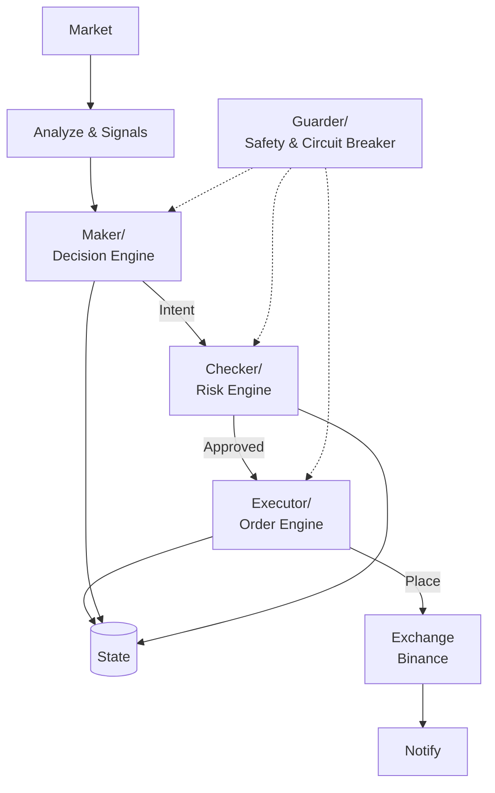

# Futures Trading

A safety-first **Go-based Binance Futures trading bot** using a Maker / Checker / Executor architecture.

## Overview

```mermaid
graph TD
    market[Market]
    analyze[Analyze & Signals]
    maker[Maker/<br/>Decision Engine]
    checker[Checker/<br/>Risk Engine]
    executor[Executor/<br/>Order Engine]
    notify[Notify]
    state[(State)]
    guarder[Guarder/<br/>Safety & Circuit Breaker]
    exchange[Exchange<br/>Binance]

    market --> analyze --> maker
    maker -->|Intent| checker
    checker -->|Approved| executor
    executor -->|Place| exchange

    executor --> state

    maker --> state
    checker --> state

    guarder -.-> maker
    guarder -.-> checker
    guarder -.-> executor
    exchange --> notify
```
